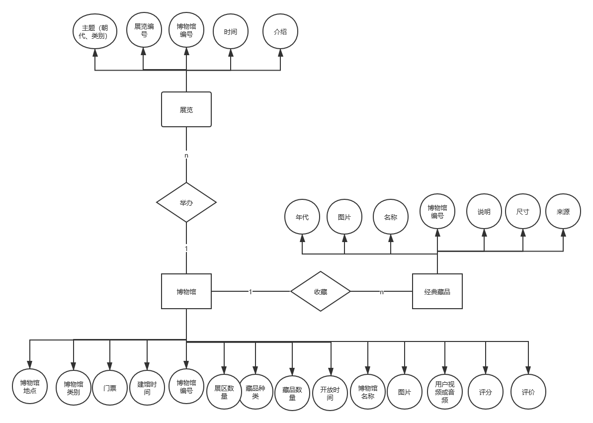

# 2020计科1702班软件工程课程设计

#### 第2组·博物馆新闻采集分析子系统

+ 数据库设计

  > ### ER图
  >
  > + 
  >
  > 
  >
  > ## 由ER图可分为三个表
  >
  >
  > ### 新闻表(News_table)（由多对多改为一对多减少一个表）
  >
  > | 中文 | 涉及博物馆  | 新闻好坏    | 爬取源      | 新闻编号           | 新闻标题    | 新闻内容    | 新闻图片    | 新闻发布时间 | 发布方      |
  > | ---- | ----------- | ----------- | ----------- | ------------------ | ----------- | ----------- | ----------- | ------------ | ----------- |
  > | 命名 | museumName  | evaluation  | source      | newsId             | newsTitle   | newsContent | newsPicture | publishTime  | Publisher   |
  > | 类型 | varchar(50) | varchar(50) | varchar(50) | int \| varchar(50) | varchar(50) | Text        | varchar(50) | datetime     | varchar(50) |
  >

  
  #### 博物馆新闻采集分析子系统

1. 通过程序能从主要的新闻网站上爬取博物馆相关的新闻信息，进行加工处理。主要包括以下功能：

   1）数据获取：爬取主要的新闻网站中的博物馆相关新闻（如百度新闻）。可以支持爬取指定时间范围内的新闻，如1年内的新闻，半年内的新闻等。

   2）数据加工：对于爬取的信息进行过滤和加工，抽取需要的内容。抽取新闻的发布时间、新闻的标题、新闻的内容、新闻涉及的博物馆，相关联网址，发布方。

   3）数据分析：对于加工好的新闻，分析是正面新闻还是负面信息。可采用已有的可直接调用的服务和代码实现。

   4）数据定制服务：可以根据指定的某一家博物馆，获取该博物馆的指定时间的新闻，并进行加工分析，得到该博物馆指定时间内的主要新闻，正面新闻和负面新闻。
