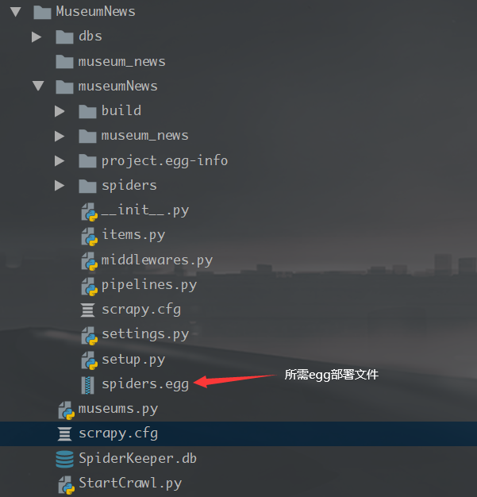

# 爬虫说明：

### 1.环境配置：

> + 使用Scrapy爬虫框架
>   - `pip install scrapy`
> + 使用Scrapyd、SpiderKeeper管理爬虫并发布到服务端
>   + `pip install scrapyd`(安装在服务器端)
>   + `pip install scrapy-client `(客户端)
>   + 配置`scrapy-deploy` 
>   + `pip install spiderkeeper` 

### 2. 目录说明：

> + **纯scrapy框架**：
>
>   

>   
>   
> + **scrapyd默认配置**:
> 
>  修改默认配置信息可以在项目下新建一个`scrapyd.conf`或者在`scrapy.cfg`中增加`[scrapyd]`：
> 
>  
> 
>  
> 
>+ **运行命令scrapyd与spiderkeeper之后的目录结构：**
> 
>  
> 
>  
> 
>+ **生成部署文件egg:**
> 
>  执行命令`scrapyd-deploy --build-egg spiders.egg`后目录：
> 
>  
> 
>  多出文件为一些配置文件不需特别修改

### 3. 部署爬虫：

上传egg文件后即可选择爬虫进行执行：

=======
